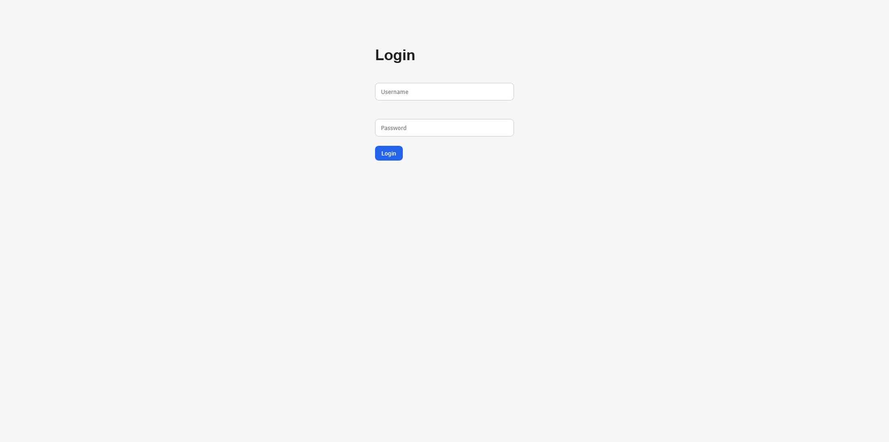
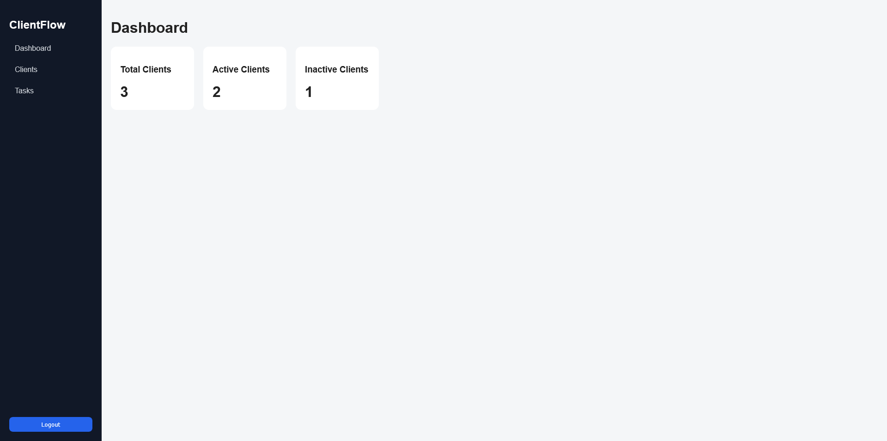
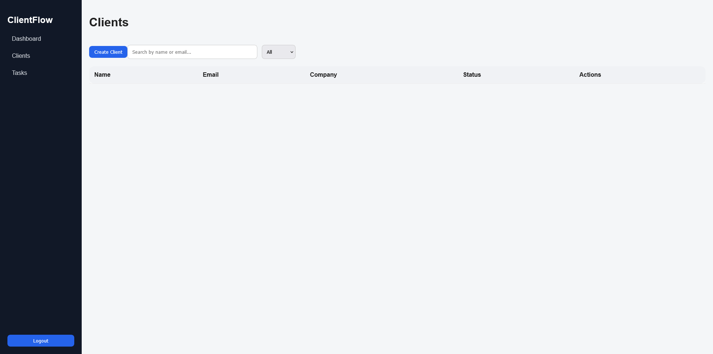
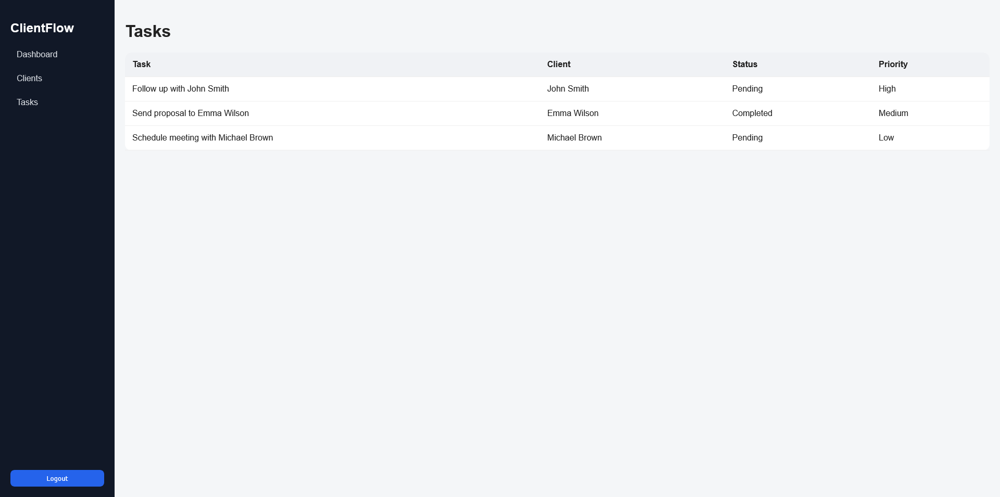

🚀 ClientFlow Dashboard

Full-stack application built with Django REST Framework and React + TypeScript.

This project simulates a real-world client management system with authentication and full CRUD functionality.

---

🛠️ Tech Stack

Backend:

- Django
- Django REST Framework
- JWT Authentication
- SQLite (ou PostgreSQL)

Frontend:

- React
- TypeScript
- React Router
- Axios

---

🔐 Features

- Authentication (JWT login)
- Protected routes
- Client management (Create, Read, Update, Delete)
- Task management
- Search and filtering
- Dashboard summary
- Basic UI system (sidebar, badges, buttons)

---

⚙️ How to run

Backend:

cd backend
pip install -r requirements.txt
python manage.py migrate
python manage.py runserver

Frontend:

cd frontend
npm install
npm run dev

---

🔗 API

Base URL:
http://127.0.0.1:8000/api

Endpoints:

/api/token/
/api/clients/
/api/clients/{id}/

---

🎯 Purpose

This project was built to demonstrate:

- Full-stack development skills
- API integration
- Authentication with JWT
- Clean architecture and code organization

---

📸 Screenshots

## 📸 Screenshots

### 🔐 Login

### 📊 Dashboard

### 👥 Clients

### 👥 Tasks

---

👨‍💻 Author

Charles Junior
